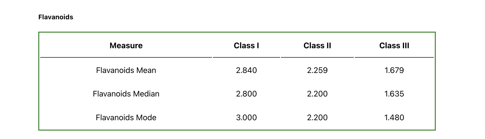
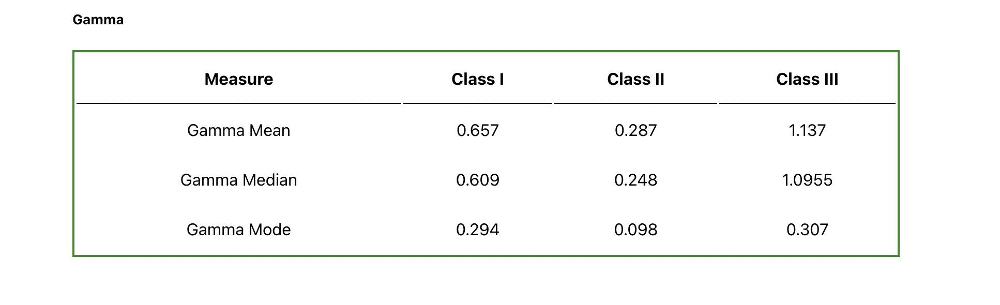

# Winedata Analysis

This project comprises of calculating the mean, median and mode of flavanoids and gamma for different classes of the alcohol.

## Flavanoids Data

## Gamma Data

## Available Scripts

In the project directory, you can run:

## `yarn start`

Runs the app in the development mode.\
Open [http://localhost:3000](http://localhost:3000) to view it in your browser.

## `yarn test`

## `yarn build`
